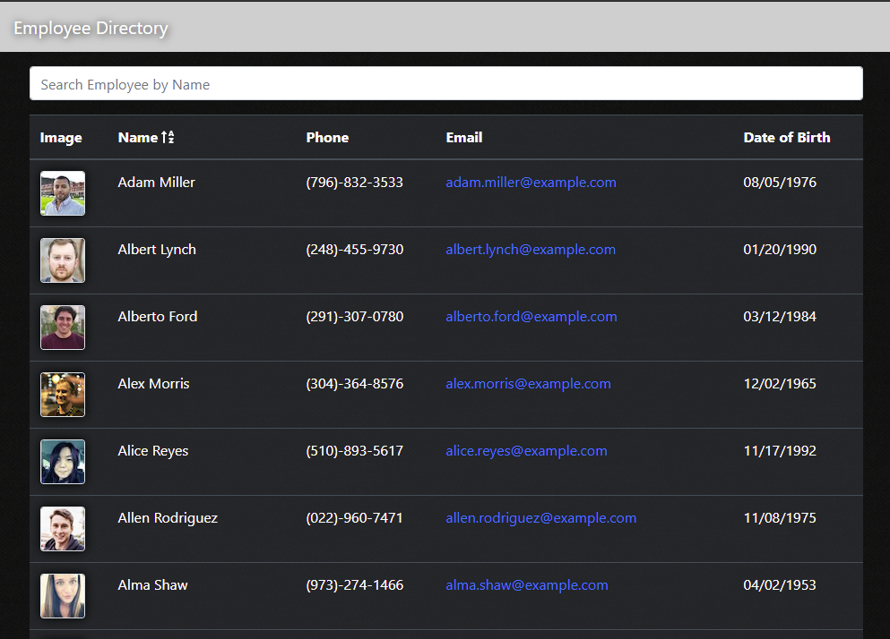

# Employee Directory

## Description
    
Employee Directory is a [React](https://reactjs.org/) application that uses the [Random User Generator](https://randomuser.me/) API to generate a list of users for a fake employee list

## Table of Contents

* [Installation](#installation)
* [Usage](#usage)
* [Preview](#preview)
* [Demo](#demo)
* [Technology Used](#tech)
* [Questions](#questions)

## Installation

#### Prerequisites

* [Node.js](https://nodejs.org/en/download/)

Download the project and run `npm i` in the directory to install the required npm packages.

## Usage

Run `npm start` to start the application and visit `http://localhost:3000` in browser to view it.

The list allows you to sort or search for employees by name.

## Preview

## Demo

A demo of this application is live on GitHub Pages

https://linosm.github.io/employee-directory/

<a name ="tech">
    
## Technology Used

* React
* JSX
* JavaScript
* Bootstrap
* Node

## Questions

If you have any questions, you can reach me through my github or email below

Github: [LinosM](https://github.com/LinosM)

Email: [NguyenDuy768@gmail.com](mailto:NguyenDuy768@gmail.com)
